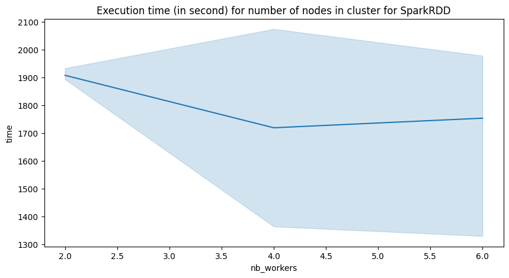
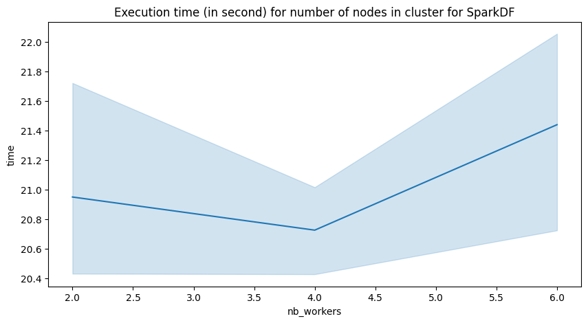
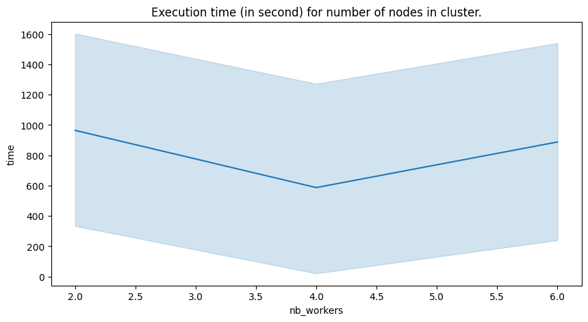

# pagerank

> Rémi MERVILLE (M2ALMA)
> 
> Monique RIMBERT (M2ATAL)

Ce projet a pour objectif de manipuler des cluster sur Google Cloud afin de calculer le pagerank sur un échantillions des données de wikipédia disponible à ce lien : https://databus.dbpedia.org/dbpedia/generic/wikilinks/2022.12.01/wikilinks_lang=en.ttl.bz2

## Reproduction de l'expérience

Configurer d'abord la machine virtuelle. Pour se faire :

1. Créer un bucket à partir de l'interface utilisateur. Pour se faire, se rendre sur la page [Buckets - Cloud Storage](https://console.cloud.google.com/storage/browser?referrer=search&cloudshell=true&hl=fr&prefix=&forceOnBucketsSortingFiltering=true&bucketType=live) et créer un nouveau bucket.
2. Exporter les variables d'environnement nécessaire.
```
export BUCKET=your-bucket-name
export PROJECT_ID=your-project-id
```
3. Se placer dans le répertoire du projet `pagerank`.
4. Pour chaque configuration, exécuter:
```
export NUMBER_WORKERS=the-number-of-nodes
bash scrip/run_full_pipeline.sh
```

#### Pour exécuter un cluster de 6 noeuds
S'ajouter le rôle "Nœud de calcul Dataproc" ou bien au moins les permissions suivantes :
```
storage.objects.get
storage.objects.update
```

## Résultats de nos expériences
<table border="1" class="dataframe">
  <thead>
    <tr style="text-align: right;">
      <th></th>
      <th>urlid</th>
      <th>rank</th>
      <th>size_input_Go</th>
      <th>type_implemantation</th>
      <th>nb_workers</th>
      <th>type_machine</th>
      <th>time</th>
      <th>iterations</th>
    </tr>
    <tr>
      <th>id</th>
      <th></th>
      <th></th>
      <th></th>
      <th></th>
      <th></th>
      <th></th>
      <th></th>
      <th></th>
    </tr>
  </thead>
  <tbody>
    <tr>
      <th>0</th>
      <td>&lt;http://dbpedia.org/resource/Category:Background_asteroids&gt;</td>
      <td>1034.093743</td>
      <td>0.919</td>
      <td>df</td>
      <td>6</td>
      <td>n4-highmem-2</td>
      <td>20.968318</td>
      <td>1</td>
    </tr>
    <tr>
      <th>1</th>
      <td>&lt;http://dbpedia.org/resource/Category:Background_asteroids&gt;</td>
      <td>1034.093743</td>
      <td>0.919</td>
      <td>rdd</td>
      <td>6</td>
      <td>n4-highmem-2</td>
      <td>197.200754</td>
      <td>1</td>
    </tr>
    <tr>
      <th>2</th>
      <td>&lt;http://dbpedia.org/resource/American_football&gt;</td>
      <td>63.250718</td>
      <td>0.919</td>
      <td>df</td>
      <td>6</td>
      <td>n4-highmem-2</td>
      <td>21.387919</td>
      <td>10</td>
    </tr>
    <tr>
      <th>3</th>
      <td>&lt;http://dbpedia.org/resource/American_football&gt;</td>
      <td>63.250939</td>
      <td>0.919</td>
      <td>rdd</td>
      <td>6</td>
      <td>n4-highmem-2</td>
      <td>1134.252870</td>
      <td>10</td>
    </tr>
    <tr>
      <th>4</th>
      <td>&lt;http://dbpedia.org/resource/American_football&gt;</td>
      <td>63.602773</td>
      <td>1.300</td>
      <td>df</td>
      <td>2</td>
      <td>n4-highmem-2</td>
      <td>20.696074</td>
      <td>10</td>
    </tr>
    <tr>
      <th>5</th>
      <td>&lt;http://dbpedia.org/resource/American_football&gt;</td>
      <td>63.602994</td>
      <td>1.300</td>
      <td>rdd</td>
      <td>2</td>
      <td>n4-highmem-2</td>
      <td>1896.579330</td>
      <td>10</td>
    </tr>
    <tr>
      <th>6</th>
      <td>&lt;http://dbpedia.org/resource/American_football&gt;</td>
      <td>63.602773</td>
      <td>1.300</td>
      <td>df</td>
      <td>2</td>
      <td>n4-highmem-2</td>
      <td>20.429264</td>
      <td>10</td>
    </tr>
    <tr>
      <th>7</th>
      <td>&lt;http://dbpedia.org/resource/American_football&gt;</td>
      <td>63.602773</td>
      <td>1.300</td>
      <td>df</td>
      <td>2</td>
      <td>n4-highmem-2</td>
      <td>21.720941</td>
      <td>10</td>
    </tr>
    <tr>
      <th>8</th>
      <td>&lt;http://dbpedia.org/resource/American_football&gt;</td>
      <td>63.602773</td>
      <td>1.300</td>
      <td>df</td>
      <td>6</td>
      <td>n4-highmem-2</td>
      <td>22.054903</td>
      <td>10</td>
    </tr>
    <tr>
      <th>9</th>
      <td>&lt;http://dbpedia.org/resource/American_football&gt;</td>
      <td>63.602994</td>
      <td>1.300</td>
      <td>rdd</td>
      <td>6</td>
      <td>n4-highmem-2</td>
      <td>1978.272810</td>
      <td>10</td>
    </tr>
    <tr>
      <th>10</th>
      <td>&lt;http://dbpedia.org/resource/American_football&gt;</td>
      <td>63.602773</td>
      <td>1.300</td>
      <td>df</td>
      <td>6</td>
      <td>n4-highmem-2</td>
      <td>20.722589</td>
      <td>10</td>
    </tr>
    <tr>
      <th>11</th>
      <td>&lt;http://dbpedia.org/resource/American_football&gt;</td>
      <td>63.602994</td>
      <td>1.300</td>
      <td>rdd</td>
      <td>6</td>
      <td>n4-highmem-2</td>
      <td>1329.799745</td>
      <td>10</td>
    </tr>
    <tr>
      <th>12</th>
      <td>&lt;http://dbpedia.org/resource/American_football&gt;</td>
      <td>63.602994</td>
      <td>1.300</td>
      <td>rdd</td>
      <td>2</td>
      <td>n4-highmem-2</td>
      <td>1933.474102</td>
      <td>10</td>
    </tr>
    <tr>
      <th>13</th>
      <td>&lt;http://dbpedia.org/resource/American_football&gt;</td>
      <td>63.602994</td>
      <td>1.300</td>
      <td>rdd</td>
      <td>2</td>
      <td>n4-highmem-2</td>
      <td>1893.842153</td>
      <td>10</td>
    </tr>
    <tr>
      <th>14</th>
      <td>&lt;http://dbpedia.org/resource/American_football&gt;</td>
      <td>63.602773</td>
      <td>1.300</td>
      <td>df</td>
      <td>6</td>
      <td>n4-highmem-2</td>
      <td>21.538329</td>
      <td>10</td>
    </tr>
    <tr>
      <th>15</th>
      <td>&lt;http://dbpedia.org/resource/American_football&gt;</td>
      <td>63.602994</td>
      <td>1.300</td>
      <td>rdd</td>
      <td>6</td>
      <td>n4-highmem-2</td>
      <td>1953.277361</td>
      <td>10</td>
    </tr>
    <tr>
      <th>16</th>
      <td>&lt;http://dbpedia.org/resource/American_football&gt;</td>
      <td>63.602773</td>
      <td>1.300</td>
      <td>df</td>
      <td>4</td>
      <td>n4-highmem-2</td>
      <td>21.014864</td>
      <td>10</td>
    </tr>
    <tr>
      <th>17</th>
      <td>&lt;http://dbpedia.org/resource/American_football&gt;</td>
      <td>63.602994</td>
      <td>1.300</td>
      <td>rdd</td>
      <td>4</td>
      <td>n4-highmem-2</td>
      <td>2074.499186</td>
      <td>10</td>
    </tr>
    <tr>
      <th>18</th>
      <td>&lt;http://dbpedia.org/resource/American_football&gt;</td>
      <td>63.602994</td>
      <td>1.300</td>
      <td>rdd</td>
      <td>4</td>
      <td>n4-highmem-2</td>
      <td>1364.143054</td>
      <td>10</td>
    </tr>
    <tr>
      <th>19</th>
      <td>&lt;http://dbpedia.org/resource/American_football&gt;</td>
      <td>63.602773</td>
      <td>1.300</td>
      <td>df</td>
      <td>4</td>
      <td>n4-highmem-2</td>
      <td>20.732722</td>
      <td>10</td>
    </tr>
    <tr>
      <th>20</th>
      <td>&lt;http://dbpedia.org/resource/American_football&gt;</td>
      <td>63.602773</td>
      <td>1.300</td>
      <td>df</td>
      <td>4</td>
      <td>n4-highmem-2</td>
      <td>20.425445</td>
      <td>10</td>
    </tr>
  </tbody>
</table>

Les expériences décrites ci-dessus on été realisées sur des machines de type **n4-highmem-2**, dont voici les caractéristiques: 
<table>
<tr>
<th>Serie</th>
<th>vCPU</th>
<th>Mémoire(Go)</th>
</tr>
<tr>
<td>N4</td>
<td>4</td>
<td>16</td>
</tr>
</table>

L'ensemble des résultats obtenus pour 10 itérations avec les deux paradigmes que nous avons utilisés converge vers le même résultat, la page la plus référencée sur 10% des données est : 
&lt;http://dbpedia.org/resource/American_football&gt;avec un rank de environ **62.6** pour chaque expérience.

### Temps d'exécution :

Pour le temps d'exécution, il y a une grande différence entre le calcul RDD et le calcul DF. L'algorithme de DataFrame s'exécute entre 20-22 secondes  alors que l'algorithme de rdd s'éxécute entre 1000 et 2000 seconde (en fonction du nombre de workers).




Voyons maintenant l'influence du nombre de workers sur la vitesse de calcul du page rank :


Le graphique ci-dessus présente le temps d'exécution du pagerank en fonction du nombre de workers alloués dans le cluster. Nous observons que le temps d'exécution est plus long pour 2 et 6 workers et que les éxécutions les plus courtes se sont fait à 4 workers. Le nombre de workers à alors une influence sur le temps d'éxécution, nous pensons qu'avec l'entièreté du fichier nous obtiendrons des meilleurs resultats pour 6 workers.


## Conclusion : 

Avec nos expériences, nous avons trouvé que le centre de Wikipédia avec les 10% des données est : &lt; http://dbpedia.org/resource/American_football &gt; avec un pagerank de **62.6**, et que le type d'algorithme et le nombre de noeuds à bien une influence sur le temps d'éxécution sur une telle quantité de données.
